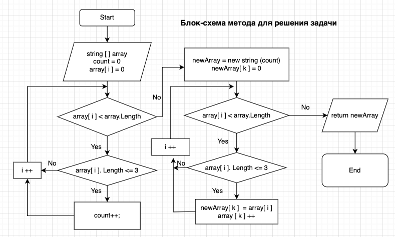

# QuizCSharp

## Итоговая проверочная работа по С#

*Задача:* Написать программу, которая из имеющегося массива строк формирует новый массив из строк, длина которых меньше, либо равна 3 символам. 

*Решение:* Создаем метод, который будет принимать в качестве аргумента имеющийся массив(далее array), а возвращать новый массив(далее newArray), удовлетворяющий условию задачи. 
1. Заводим переменную-счетчик, присваиваем ей нулевое значение. Проходим по каждому элементу array и проверяем его на прохождение условия (меньше трех символов). При прохождении условия увеличиваем значение счетчика.
2. На основе значения счетчика как размера массива формируем newArray.
3. Снова проходим по array проверяя каждый элемент на прохождение условия (меньше трех) и добавляем каждый подходящий элемент в newArray.
4. Возвращаем newArray.

Для создания исходного массива и вывода решения созданы отдельные методы.

